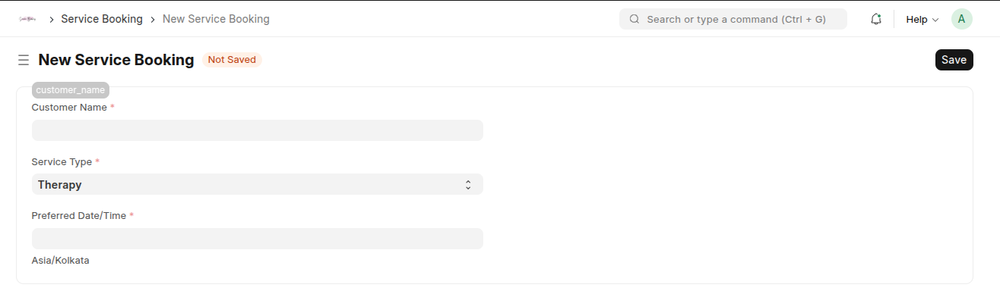
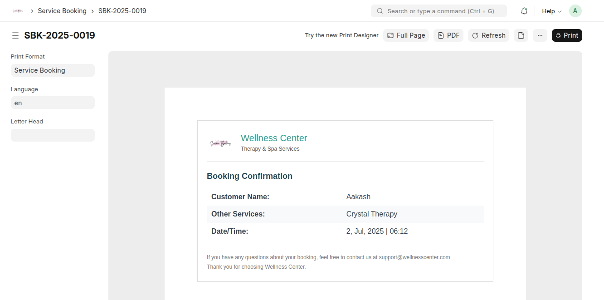
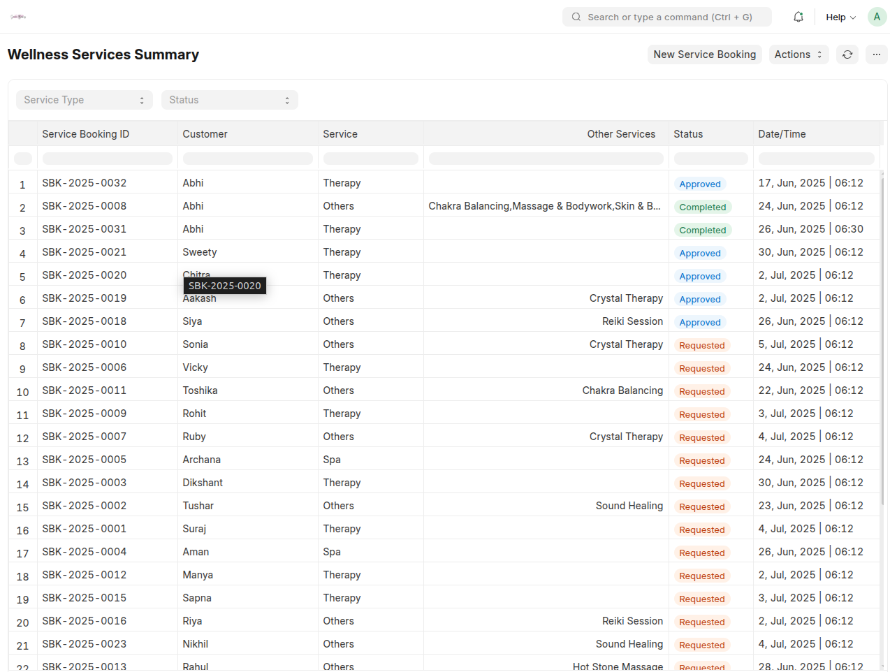
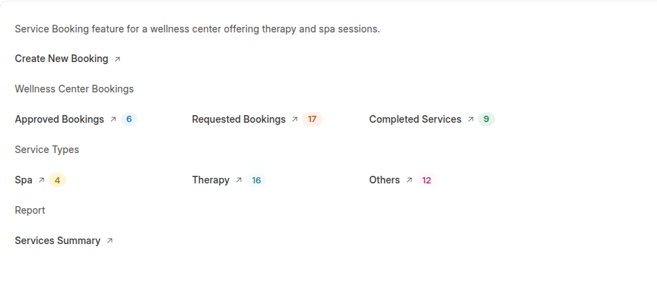

# Wellness Service Booking App

Custom ERPNext module to manage service bookings at a wellness center.

---

## 🚀 Features

- Custom Doctype: `Service Booking`


- Workflow: Requested → Approved → Completed
- Email confirmation on approval via `Email Template`
- Custom Jinja-based print format for Booking Confirmation



- Script Report: Filter by Service Type & Status with color-coded indicators


- **Workspace:** Dedicated “Wellness Center” desk with quick actions and status insights
- (Bonus) REST API Integration: Booking data pushed to a dummy webhook on approval

---

## 🧩 Workspace: Wellness Center

A new **Workspace** titled **"Wellness Center"** is added under the Desk.

### Includes:

- ✅ **Shortcut:** Create New Booking (`/app/service-booking/new`)
- 📊 **Dash Stats:**
  - Total **Requested**
  - Total **Approved**
  - Total **Completed**

These counts are dynamically fetched from the `Service Booking` doctype using dashboard cards.

---

## 🛠️ Setup Instructions

```bash
# Clone the repo into your Frappe bench
cd ~/frappe-bench/apps
git clone https://github.com/yourusername/service_booking_management.git

# Install the app on your site
bench --site yoursite install-app service_booking_management

# Migrate
bench --site yoursite migrate
```
